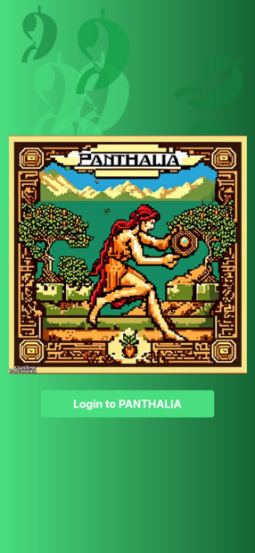
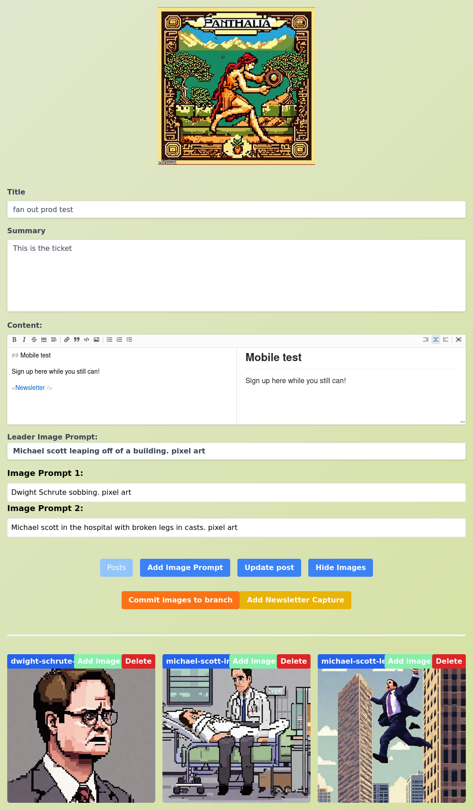
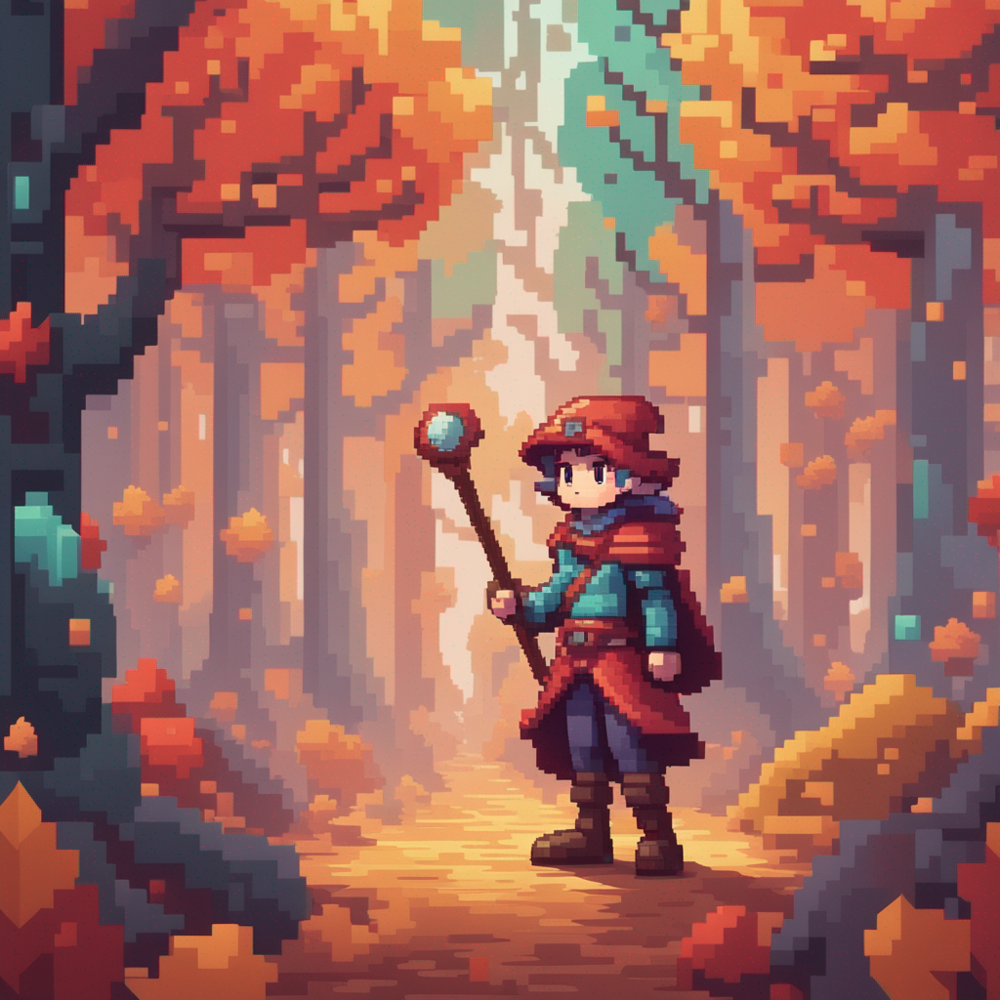
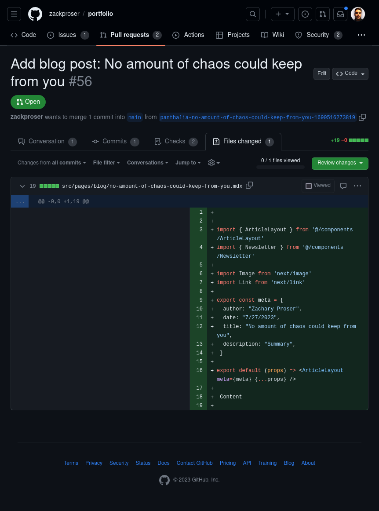
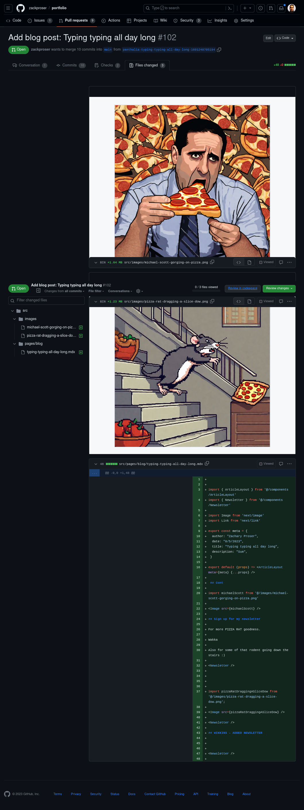

# Panthalia 🌎👁️‍🗨️ 🎨 🖋️🚶

> Panthalia (/panˈTHālēə/) combines the Greek roots pan- ("all"), thalia ("Muse of comedy and idyllic poetry"). The intended meaning is "flourishing or creating everywhere." 

## Overview

Panthalia is a homebrewed blog post accelerator system - it allows me to author rich media blog posts, from ideation through to publishing live, while waiting in line somewhere - on my phone.

It is very much tightly coupled to the architecture of my blog and the manner in which I compose blog posts. While it leverages some "AI" services, the main purpose of the project *is not* to have AI take 
over authoring blog posts for me or in my style. 

**Panthalia enables me to kick-off blog posts as quickly as I can think of ideas for new posts** - and gives me the option to either see production all the way through on my phone, or return to the pull request opened by Panthalia once I'm back at a laptop or desktop.

## Available anywhere 

A mobile-first experience available anywhere            | Guarded by GitHub oAuth
:-------------------------:|:-------------------------:
 | 

## Mobile form-factor - but unlimited creative potential

Everything I could normally build into one of my blog posts on my favorite work laptop is now available on my phone.

The mobile interface is simple but powerful - because I intentionally built my blog around the MDX file format - I can write complete blog posts including images, videos and links - while also generating 
any arbitrary images for both the "leader" or "hero" image that's shown on the blog post's index page - as well as an arbitrary number of additional images of any kind that I can slot into a blog post body. 

## Generate and insert multiple images 

For example, when creating a new post, I may already have in mind an idea of the series of images that will best help me tell the story, so I can request them at post creation time: 

I wired up a Markdown "What you see is what you get" (WYSIWYG) editor for my content - so I can also include rich elements such as my newsletter subscription widget, for example. 

This turns out to be also be very powerful, because I can code my own custom actions, such as one-click inserts for the generated images, or adding my newsletter capture widget with another click. 

## Image generation via StableDiffusion XL

A couple of months ago, I started experimenting with using StableDiffusion generated images for my blog posts. 

I'm especially [fond](https://www.zackproser.com/blog/maintaining-this-site-fucking-sucks) of [generating](https://www.zackproser.com/blog/maintaining-this-site-no-longer-fucking-sucks) pixel [art](https://www.zackproser.com/blog/i-am-joining-pinecone-io) or [neon-punk](https://www.zackproser.com/blog/video-reviewing-github-prs-in-terminal) style images - and I found a great Discord that runs several bots allowing you to generate images on demand.

The public discord was great for allowing me to experiment with this workflow, but ultimately I decided I liked being able to generate arbitrary blog post images so much that I wanted my own reliable pipeline for unlimited image generation. 

Panthalia accomplishes this by connecting up to StableDiffusionXL (SDXL) running on Replicate - a pretty sweet service that lets you call all manner of machine learnings models via REST API calls. 

The leader image prompt is generated asynchronously in the background, as are any other number of images I requested on initial post submission. When I hit my edit post page, all of the images generated for that post 
are displayed. Images can be "rejected" - meaning I don't like them for some reason or they're borked - and they'll be deleted simultaneously in the database and S3. 

Images can also be accepted - those are separately saved to the same branch as the blog post and pushed up to GitHub. 

## Pull requests, branch updates and Vercel preview deployments

Panthalia immediately opens a pull request for every new post submission I create - because, at least for me, writing is an iterative process. I usually have the blocks of content roughly arrayed in my mind before I start writing, so I'll hammer those out and submit. That results in Panthalia 

* cloning my portfolio repository 
* creating a unique branch 
* adding my new post in the right place
* committing and pushing it to GitHub 
* using the GitHub API to open a pull request

Since my portfolio / blog site is hosted on Vercel, I get deployment previews for free in this workflow, which are also ideal for review on mobile. I can easily start a new post, take a look at it via my pull request's preview URL, then edit that post via Panthalia and submit several more updates 
which will end up pushed on the same branch - resulting in a new Vercel preview deployment with my latest changes. 

Panthalia supports blog posts that are simple and only contain text, as well as rich multi-media posts containing a mix of generated images and MDX components like my Newsletter capture widget: 

Once back at my laptop, posts can be polished and their pull requests merged to publish them live on my blog. For many blog posts, the loop is sufficiently powerful for me to author and publish them live - start to finish - because merging the pull request results in a live deployment to [https://zackproser.com](https://zackproser.com).

```mermaid
graph LR;
    A[User Accesses Panthalia App] --> B[Create New Post];
    B --> D{Post Created in Vercel Postgres};
    B --> C[Branch Created in Portfolio Site];
    C --> E[Pull Request Opened];
    D --> F[Edit Post Content];
    F --> G{Happy with Post?};
    G --> |No| F;
    G --> |Yes| H[Finalize and Merge Pull Request];
    F --> I[Prompt for Image Generation];
    I --> J[Generate Image Stable Diffusion];
    J --> F;
```

## Architecture, philosophy and challenges

See the [CONCEPTS doc](./docs/CONCEPTS.md) to learn more about Panthalia'as architecture and philosophy. 

## Why build this? 

1. I get a lot of ideas for blog posts I want to write - especially if I'm out and about, walking around or doing something away from my usual laptop - which is optimized for crafting blog posts comprised of images, videos, etc. The idea behind Panthalia is - instead of writing myself notes in markdown into my second brain in Obsidian, just to copy them out later and turn them into posts - instead just create the pull requests against my portfolio repository 
which contains my blog. My hope is that by lowering the friction to publish a full blog post, I can fire off the initial pull requests for my next 5 posts from my phone while waiting in line somewhere - up to and including using Stable Diffusion to generate my 
blog post images - which I've been [doing lately](https://www.zackproser.com/blog/first-see-if-youve-got-the-bug) and [really enjoying](https://www.zackproser.com/blog/i-am-joining-pinecone-io). 
2. The usual answer: for fun and practice. I wanted to get way deeper into the latest Next.js framework, test out Vercel Postgres, and build a highly performant, fully asynchronous workflow using only serverless functions. 

## Features

See the [FEATURES doc for current and future features](./docs/FEATURES.md).

## Stack 
* Next.js
* Vercel
* Vercel Postgres for post content and image metadata
* AWS S3 for image storage

